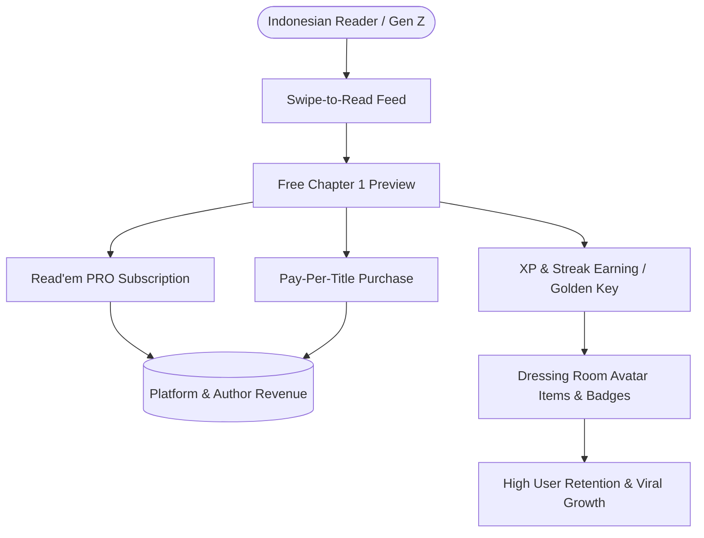
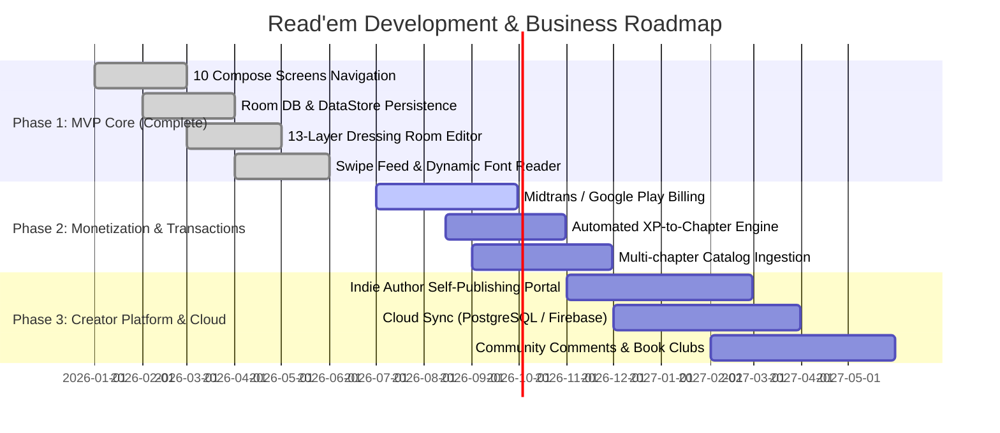

# Read'em (Alar Walen)

> **Gamified Digital Reading Platform for the Indonesian Market**  
> *Proyek Akhir Kewirausahaan (Entrepreneurship Capstone Project)*

Read'em is an Android reading application built with **Jetpack Compose**, designed to revitalize reading habits among Indonesian Gen Z and Millennials. By merging social media-style card discovery (swipe-to-read) with RPG-style gamification (XP reading economy and a 13-layer avatar dressing room), Read'em transforms digital reading from a passive activity into an engaging, rewarded lifestyle.


---

## 1. Executive Business Summary

### The Problem
* **Low Digital Reading Retention:** Traditional e-readers present friction-heavy discovery and lack motivational feedback loops for younger Indonesian readers.
* **Fragmented & Expensive Microtransactions:** Existing web novel platforms (e.g., Wattpad, Webtoon) rely on costly, piecemeal coin paywalls that alienate price-sensitive domestic readers.
* **Lack of Reader Identity & Rewards:** Reading achievements remain abstract numbers rather than expressive, customizable social identities.

### The Read'em Solution
1. **Zero-Friction Swipe Feed:** Full-screen book cards inspired by short-form video UI. Swipe right to immediately dive into Chapter 1; swipe left to cycle to the next title.
2. **Gamified XP Economy:** Readers earn experience points (+10 XP per page, +50 XP streak bonus) that unlock subsequent chapters and level up reader rank credentials.
3. **Layered Avatar Dressing Room:** An interactive 13-slot composable character editor where users personalize their avatar (hoods, robes, boots, staffs, accessories) using drag, pinch-to-scale, and layer ordering, persisting their look locally.
4. **Local-First & Zero-Latency:** Built with Room SQLite and DataStore Preferences to ensure 100% offline readability across varying Indonesian network conditions.

---

## 2. Business Model & Financial Strategy



### Monetization Tiers (Target Market: Indonesia)

| Tier | Price Point | Access & Benefits | Target Audience |
|---|---|---|---|
| **Tier 1: Free Tier** | `Rp 0` | • Free Chapter 1 previews for all books<br>• Earn +10 XP/page & +50 XP streak bonuses<br>• Unlock chapters via XP & Level-up Golden Keys | Casual readers, students, new user acquisition |
| **Tier 2: Single Book (Pay-per-Title)** | `Rp 50.000 – Rp 150.000` | • Permanent lifetime offline ownership of a specific book<br>• Exclusive author notes & bonus artwork | Single-series enthusiasts, collector readers |
| **Tier 3: Read'em PRO Monthly** | **`Rp 49.000 / bulan`** | • Unlimited access to all catalog chapters<br>• Zero advertisements & priority support<br>• Exclusive VIP Dressing Room avatar items | Active readers, power users |
| **Tier 4: Read'em PRO Yearly** | **`Rp 399.000 / tahun`**<br>*(Save ~32%)* | • All Pro Monthly features<br>• Early access to beta releases and new indie titles<br>• Monthly bonus Golden Key drops | Long-term subscribers, dedicated book clubs |

### Key Unit Economics & Projections

* **Average Revenue Per User (ARPU):** `Rp 1.758 / user / month` (blended across free and paying cohorts).
* **Customer Acquisition Cost (CAC):** `< Rp 3.500 / user` (driven by viral TikTok/Instagram BookTok card sharing and gamified streak invites).
* **Customer Lifetime Value (LTV):** `Rp 294.000` (based on 6–8 month average retention for PRO subscribers).
* **Break-Even Point (BEP):** **`26.500 MAU`** (Monthly Active Users).

---

## 3. Application Features & UI Mapping

The application is structured into **10 connected destinations** across a single unified `NavHost`:

| Screen / Module | Implementation File | Business Purpose & Key Functionality |
|---|---|---|
| **1. Feed Screen** | [`FeedScreen.kt`](file:///f:/Github/Proyek-Akhir-Kewirausahaan/app/src/main/java/com/example/proyek_akhir_kewirausahaan/ui/screens/FeedScreen.kt) | **Acquisition Hook:** Full-screen snap cards with gesture detection. Swipe right (`onReadFirstChapter`) to read immediately, swipe left (`onRemoveBook`) to dismiss. Real-time reader counts, share action, and favorite bookmarking. |
| **2. Book Detail** | [`BookDetailScreen.kt`](file:///f:/Github/Proyek-Akhir-Kewirausahaan/app/src/main/java/com/example/proyek_akhir_kewirausahaan/ui/screens/BookDetailScreen.kt) | **Conversion Funnel:** Book synopsis, genre metadata, rating, total chapter count, reading time estimate, and primary "Read" CTA button. |
| **3. Reading Screen** | [`ReadingScreen.kt`](file:///f:/Github/Proyek-Akhir-Kewirausahaan/app/src/main/java/com/example/proyek_akhir_kewirausahaan/ui/screens/ReadingScreen.kt) | **Core Consumption & Paywall:** Clean reader with dynamic font size scaling (12–32 pt). End-of-preview chapter paywall banner gating subsequent chapters behind XP or PRO status. |
| **4. Dressing Room** | [`DreesUpScreen.kt`](file:///f:/Github/Proyek-Akhir-Kewirausahaan/app/src/main/java/com/example/proyek_akhir_kewirausahaan/ui/screens/DreesUpScreen.kt) | **Retention & Gamification Engine:** Composable 13-layer avatar editor (skin, hair, eyes, robe, armor, hood, staff, pet, etc.). Supports per-layer dragging, pinch-to-scale, visibility toggles, and JSON serialization to DataStore. |
| **5. Profile & XP** | [`ProfileScreen.kt`](file:///f:/Github/Proyek-Akhir-Kewirausahaan/app/src/main/java/com/example/proyek_akhir_kewirausahaan/ui/screens/ProfileScreen.kt) | **Status & Achievement:** Reader rank level (e.g. *Premium Archivist*), active streak counter (48 days), 4-week XP bar chart, and RPG credential badges (`POLYMATH`, `DEEP THINKER`, `SCRIBE`, `CURATOR`). |
| **6. Search Screen** | [`SearchScreen.kt`](file:///f:/Github/Proyek-Akhir-Kewirausahaan/app/src/main/java/com/example/proyek_akhir_kewirausahaan/ui/screens/SearchScreen.kt) | **Catalog Exploration:** 300 ms debounced live search query running over SQLite FTS/LIKE in Room database. |
| **7. Library Screen** | [`LibraryScreen.kt`](file:///f:/Github/Proyek-Akhir-Kewirausahaan/app/src/main/java/com/example/proyek_akhir_kewirausahaan/ui/screens/LibraryScreen.kt) | **User Collection:** Tabbed reading sessions (Recently Opened / In Progress) with linear progress indicators. |
| **8. Settings** | [`SettingScreen.kt`](file:///f:/Github/Proyek-Akhir-Kewirausahaan/app/src/main/java/com/example/proyek_akhir_kewirausahaan/ui/screens/SettingScreen.kt) | **Personalization:** Dynamic font size slider, notification toggles (daily reminders, new releases), custom avatar URI selector, display name editor, and subscription shortcut. |
| **9. Subscription** | [`SubscriptionScreen.kt`](file:///f:/Github/Proyek-Akhir-Kewirausahaan/app/src/main/java/com/example/proyek_akhir_kewirausahaan/ui/screens/SubscriptionScreen.kt) | **Monetization Portal:** Plan comparison cards showing PRO Monthly (`Rp 49.000/bln`) and PRO Yearly (`Rp 399.000/thn`) with feature breakdown and payment CTA. |
| **10. Support** | [`SupportScreen.kt`](file:///f:/Github/Proyek-Akhir-Kewirausahaan/app/src/main/java/com/example/proyek_akhir_kewirausahaan/ui/screens/SupportScreen.kt) | **Customer Care:** In-app help center, FAQ, and author support channel. |

---

## 4. Technical Architecture

The codebase follows **Clean Architecture & MVVM** principles, ensuring a strict boundary between UI composables, domain use cases, and local storage layers:

```
UI Layer (10 Compose Screens)
        │
        ▼
ReademViewModel  ◄──────►  ReademUiState (Single Reactive StateFlow)
        │
        ├── GetAllBooksUseCase
        ├── SearchBooksUseCase
        ├── ToggleFavoriteUseCase
        └── GetUserProfileUseCase
                │
                ▼
        BookRepository (Domain Interface)
                │
       ┌────────┴────────┐
       ▼                 ▼
BookRepositoryImpl     BookRepositoryImpl
(data.repository)      (model.repository)
- Room SQLite DAO      - In-Memory Seed (DataSource.kt)
- Flow<List<Book>>     - Profile, Chapters & Read Sessions
```

### Local Persistence Strategy
1. **Room SQLite (`AppDatabase` + `BookDao`):** Persists book catalog metadata and user favorite flags. Recompositions are automatically triggered via Kotlin Coroutines `Flow`.
2. **DataStore Preferences (`UserPreferences`):** Stores user identity without SQLite schema overhead:
   * `user_name` - Custom display name string.
   * `avatar_uri` -  Local photo gallery URI.
   * `avatar_look_json` - Serialized JSON representation of all 13 avatar layer transforms (offsets, scales, visibility).

---

## 5. Technology Stack

| Layer | Technology | Rationale |
|---|---|---|
| **Language** | Kotlin 2.x | Modern, concise, coroutine-native language |
| **UI Framework** | Jetpack Compose (Material3) | Declarative UI for dynamic animations and fluid gesture handling |
| **Navigation** | Navigation Compose | Single-activity architecture with 10 type-safe routes |
| **State Management** | `StateFlow` + `collectAsState` | Unidirectional data flow (UDF) preventing state inconsistencies |
| **Local Database** | Room 2.x (KSP annotation processor) | Robust SQLite abstraction for offline catalog persistence |
| **Key-Value Store** | AndroidX DataStore Preferences | Lightweight, coroutine-safe persistence for user configurations |
| **Image Loading** | Coil Compose | Asynchronous, cached image rendering |
| **Target Platforms** | Android 7.0 (API 24) to Android 16 (API 36) | Broad compatibility across budget and flagship devices in Indonesia |

---

## 6. Project Roadmap & Milestone Execution



* **MVP: Complete**
  * [x] End-to-end navigation across all 10 screens.
  * [x] Interactive swipe-to-read feed with spring-back animations.
  * [x] 13-layer composable avatar dressing room with real-time drag/pinch-to-scale.
  * [x] Room SQLite persistence for book favorites and search indexing.
  * [x] DataStore persistence for user profiles, display names, and avatar JSON.
  * [x] Dynamic typography adjustment (12–32 pt).
  * [x] Localized IDR subscription pricing UI (`Rp 49.000/bln` and `Rp 399.000/thn`).

* **Future work**
  * [ ] Integrate Midtrans / Xendit / Google Play Billing for IDR payments.
  * [ ] Connect automated XP deduction and Golden Key chapter unlocking logic.
  * [ ] Seed full multi-chapter content for all 6 catalog books.
  * [ ] Persist active read sessions directly to Room SQLite.
  * [ ] Web portal for Indonesian indie authors with 70/30 revenue sharing.
  * [ ] Cloud database sync (PostgreSQL / Supabase) for cross-device reading progress.
  * [ ] Social reading clubs and community commentary threads.

---

## 7. Team & Academic Context

* **Project Title:** Read'em (Alar Walen)
* **Course:** Kewirausahaan (Entrepreneurship)
* **License:** MIT License
